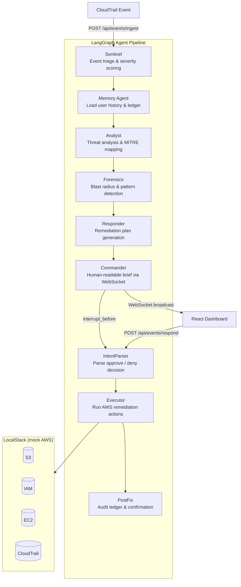

# NovaSec

**AI-powered cloud security event pipeline with human-in-the-loop incident response.**

🔴 **Live demo:** [https://novasec-frontend-1nu2.onrender.com](https://novasec-frontend-1nu2.onrender.com)

Cloud security today is broken in two opposite ways — either you drown in raw CloudTrail noise with no context, or you wait days for a human analyst to tell you something already went wrong. NovaSec fixes this by sitting at the exact middle: the moment a suspicious AWS event fires, it runs through a 9-agent AI pipeline powered by Google Gemini 2.5 Flash that triages the event, pulls the user's full incident history, maps the attack to a MITRE ATT&CK technique, calculates the blast radius of what the attacker could have touched, proposes a concrete boto3 remediation action, and delivers a plain-English Commander brief to your dashboard in seconds — all while keeping a human in control of every consequential decision. You approve or deny the fix; if you don't act within 2 minutes, the system auto-approves to prevent stale threats sitting unresolved. The result is mean-time-to-response measured in seconds rather than hours, a full audit ledger of every agent decision, and a system that gets smarter with every incident because Memory Agent tracks repeat offenders across sessions and escalates them automatically.

---

## Why it exists

Cloud security tooling is either too noisy (raw CloudTrail dumps) or too slow (weekly audit reports). NovaSec sits in between: it ingests CloudTrail-style events the moment they happen, reasons about them with a chain of specialized AI agents, maps every threat to MITRE ATT&CK, and puts a human decision — approve the automated fix or deny it — at the exact right moment. The goal is to cut mean-time-to-response from hours to seconds while keeping a human in the loop for every consequential action.

---

## Architecture



**Human-in-the-loop**: the graph pauses at `IntentParser` (`interrupt_before`) and waits for the operator's decision. Every thread is tracked in `THREAD_STORE` and auto-approved after 2 minutes if no action is taken.

---

## Project structure

```
NovaSec/
├── backend/          # FastAPI + LangGraph pipeline
│   ├── agents/       # 9 individual agent modules
│   ├── api/          # REST endpoints (events, query, websocket)
│   ├── core/         # LangGraph graph, state, config, prompts
│   └── utils/        # Ledger store, LocalStack seeder, MITRE mapper
├── frontend/         # Vite + React + TypeScript dashboard
│   └── src/
│       ├── components/   # CommanderChat panel
│       ├── hooks/        # useNovaSec (all API + WS logic)
│       ├── utils/        # chaosMonkey.ts
│       └── views/        # Dashboard, Incidents, ThreatIntel, IAMExplorer
├── docker-compose.yml
└── .env              # Never committed — see below
```

---

## Quick start

### Prerequisites

| Tool | Version |
|---|---|
| Python | 3.11+ |
| Node.js | 20+ |
| Docker + Docker Compose | any recent |

### 1. Clone and set up environment

```bash
git clone https://github.com/ShiroYasha18/NovaSec.git
cd NovaSec
```

Copy the environment template and fill in your keys:

```bash
cp .env.example .env   # then open .env and add your GOOGLE_API_KEY
```

Required variables:

```
GOOGLE_API_KEY=your_gemini_api_key_here
GEMINI_MODEL=gemini-2.5-flash
USE_LOCALSTACK=true
AWS_DEFAULT_REGION=us-east-1
AWS_ACCESS_KEY_ID=test
AWS_SECRET_ACCESS_KEY=test
```

> AWS credentials are `test`/`test` — LocalStack doesn't validate them.

### 2. Start LocalStack (mock AWS)

```bash
docker run --rm -d -p 4566:4566 localstack/localstack
```

### 3. Start the backend

```bash
cd backend
python -m venv ../.venv && source ../.venv/bin/activate   # first time only
pip install -r requirements.txt                            # first time only
uvicorn main:app --host 0.0.0.0 --port 8001 --reload
```

Backend is live at `http://localhost:8001`.

### 4. Start the frontend

```bash
cd frontend
npm install        # first time only
npm run dev
```

Frontend is live at `http://localhost:3000`.

### Docker Compose (all-in-one)

```bash
docker compose up --build
```

Runs LocalStack + backend + frontend in one command.

---

## Features at a glance

| Feature | Description |
|---|---|
| 9-agent AI pipeline | Sentinel → Memory → Analyst → Forensics → Responder → Commander → IntentParser → Executor → PostFix |
| MITRE ATT&CK mapping | Every event mapped to a technique ID and tactic |
| Blast radius analysis | Per-user impact assessment powered by Gemini |
| Pattern detection | Detects repeated suspicious behaviour across a user's history |
| Human-in-the-loop | Every incident waits for your approve / deny decision |
| Auto-approve | Falls back to automatic approval after 2 minutes |
| Chaos Monkey | Fires random AWS security events every 20 seconds for testing |
| IAM Explorer | Click any IAM user to simulate their blast radius |
| Commander Chat | Natural language interface to the pipeline — ask anything |
| Real-time WebSocket | Live Commander briefs pushed to the dashboard instantly |

---

## Detailed guides

- [Backend — installation, agents, API reference](./backend/README.md)
- [Frontend — installation, views, components, design tokens](./frontend/README.md)
